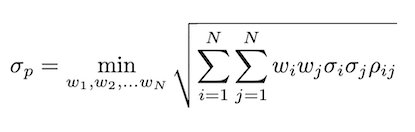
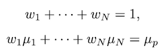
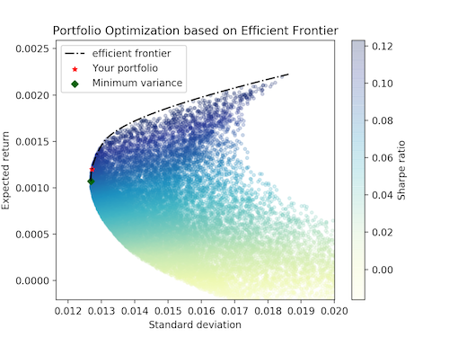

# Moskowitz's efficient frontier

### The problem:

- minimize portfolio risk (i.e. sigma)

- under the following constraints:

### The code:
- main.py contains all functions needed
- example.py allows the user to run simulations, based on daily returns, using all SP500 stocks, a sample of them, or a custom list of tickers.
Optimal weights are printed and, if applicable, more hints are given. The results can also be visualized, see below. example.py can easily be modified to work with monthly returns and calculate the tangency portfolio.

For more information see:
- https://www.investopedia.com/terms/e/efficientfrontier.asp
- https://en.wikipedia.org/wiki/Efficient_frontier
- https://doi.org/10.2307%2F2975974 "Portfolio Selection" (1952), H.M. Markowitz
